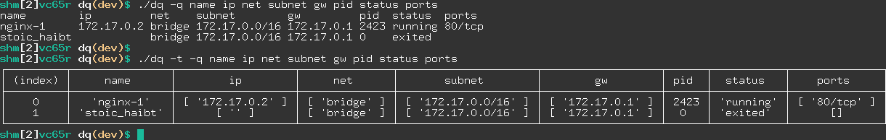

# dq
Debug docker quickly using **D**ocker **Q**uery

Debugging one container using `docker inspect` is okay if we are running just one.  
But debugging many of them with different networks, names, ports, etc can be cumbersome.  
**dq** is a simple CLI to query API, extract some information and show it for all containers.

## Designed for
Anyone whats to debug small to medium size running containers.  
Anyone learns and teaches docker and containers:
 - System Administrator, DevOps, Troubleshooter, etc
 - YouTubers
 - Bloggers
 - Course makers
 - etc


## Examples
For two containers, one is running, one is not.

```bash
docker ps --all
CONTAINER ID   IMAGE                    COMMAND                  CREATED       STATUS                   PORTS                                   NAMES
1096b57f9049   nginx:alpine             "/docker-entrypoint.…"   2 hours ago   Up 2 hours               0.0.0.0:8080->80/tcp, :::8080->80/tcp   nginx-1
0e764fa35fe2   docker/getting-started   "/docker-entrypoint.…"   2 weeks ago   Exited (0) 2 weeks ago                                           stoic_haibt
```

Query for:
 - name
 - ip
 - net
 - subnet
 - gateway
 - pid
 - status
 - ports


```bash
./dq -q name ip net subnet gw pid status ports
name        ip         net    subnet        gw         pid  status  ports
nginx-1     172.17.0.2 bridge 172.17.0.0/16 172.17.0.1 2423 running 80/tcp
stoic_haibt            bridge 172.17.0.0/16 172.17.0.1 0    exited
```
That was normal output, but we can have an table output:
```bash
./dq -t -q name ip net subnet gw pid status ports
┌─────────┬───────────────┬──────────────────┬──────────────┬─────────────────────┬──────────────────┬──────┬───────────┬──────────────┐
│ (index) │     name      │        ip        │     net      │       subnet        │        gw        │ pid  │  status   │    ports     │
├─────────┼───────────────┼──────────────────┼──────────────┼─────────────────────┼──────────────────┼──────┼───────────┼──────────────┤
│    0    │   'nginx-1'   │ [ '172.17.0.2' ] │ [ 'bridge' ] │ [ '172.17.0.0/16' ] │ [ '172.17.0.1' ] │ 2423 │ 'running' │ [ '80/tcp' ] │
│    1    │ 'stoic_haibt' │      [ '' ]      │ [ 'bridge' ] │ [ '172.17.0.0/16' ] │ [ '172.17.0.1' ] │  0   │ 'exited'  │      []      │
└─────────┴───────────────┴──────────────────┴──────────────┴─────────────────────┴──────────────────┴──────┴───────────┴──────────────┘
```

A screenshot of two above queries:



The same query where there are more:
```bash
./dq -q name ip net subnet gw pid status ports
name                           ip                     net                   subnet                       gw                     pid     status  ports
ocserv-docker_ocserv_1         172.19.0.2             ocserv-docker_default 172.19.0.0/24                172.19.0.1             2787426 running 443/tcp,443/udp
radius                         172.19.62.3            radius-ui_default     172.19.62.0/24               172.19.62.1            3968972 running 1812/tcp,1812/udp,1813/tcp,1813/udp,80/tcp
radius-mysql                   172.19.62.2            radius-ui_default     172.19.62.0/24               172.19.62.1            3868824 running 3306/tcp
ingress_nginx-proxy_1          172.18.0.5             br0                   172.18.0.1/16                172.18.0.1             3846630 running 443/tcp,80/tcp
ingress_nginx-default_1        172.18.0.4             br0                   172.18.0.1/16                172.18.0.1             3840347 running 80/tcp
minio_minio-nginx_1            172.18.0.6,172.19.52.3 br0,minio_default     172.18.0.1/16,172.19.52.0/24 172.18.0.1,172.19.52.1 3371918 running 80/tcp
minio_minio-server_1           172.19.52.2            minio_default         172.19.52.0/24               172.19.52.1            3371794 running 9000/tcp
drone-runner_drone-agent_1     172.19.7.2             drone-runner_default  172.19.7.0/24                172.19.7.1             2942737 running 3000/tcp
ingress_whoami_1               172.18.0.3             br0                   172.18.0.1/16                172.18.0.1             3732128 running 8000/tcp
ingress_nginx-acme-companion_1 172.18.0.2             br0                   172.18.0.1/16                172.18.0.1             3732325 running
```

Another Query for:
 - name
 - hostip (host ip)
 - ip (container ip)
 - hostport (host port)
 - port (container port)
 - gw (gateway)
 - subnet
 - net
 - scope

```bash
./dq -q name hostip ip hostport port gw subnet net scope
name        hostip                ip         hostport            port           gw         subnet        net    scope
nginx-3     0.0.0.0,::,0.0.0.0,:: 172.17.0.4 8088,8088,8082,8082 443/tcp,80/tcp 172.17.0.1 172.17.0.0/16 bridge local
nginx-2     0.0.0.0,::            172.17.0.3 8081,8081           80/tcp         172.17.0.1 172.17.0.0/16 bridge local
nginx-1     0.0.0.0,::            172.17.0.2 8080,8080           80/tcp         172.17.0.1 172.17.0.0/16 bridge local
stoic_haibt                                                                     172.17.0.1 172.17.0.0/16 bridge local
```

## Prerequisite
App has been written in **Node.js**, so having Node.js and npm is needed.

## How to install
First clone the repository:
```bash
git clone https://github.com/shakibamoshiri/dq.git
```

Then `cd` to **dq** directory
```bash
cd dq
```

Then run `npm` to install dependencies
```bash
npm install
```

Then test it
```bash
./dq -h
```

You should see help output. At this port you can use it in a local directory or installing globally
```bash
sudo chmod +x dq
sudo install dq -t /usr/local/bin/
```

## API compatibility
You can run [check-docker-api.sh](./check-docker-api.sh) to check your Docker API.  
`dq` has been tested and compatible with [Docker Engine API (v1.41)](https://docs.docker.com/engine/api/v1.41/) 
